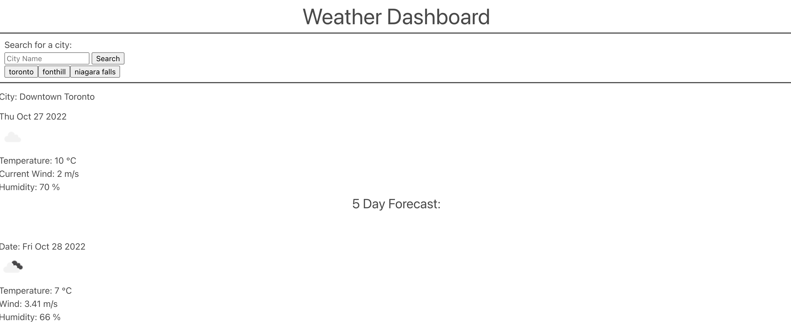

# Module 6 Challenge: Weather Application 

## Description

This project was built in order to retrieve data for desired Canadian cities. When a city name is inputted into the search bar, the weather information for the city for the present day and future 5 days. The weather components appearing on the screen include the temperature, wind, humidity, and an icon representing the weather conditions. This project was built so that the user can easily access the weather conditions for a desired city. This project helped to further advance my knowledge on Javascript and API calling.

## Usage

This webpage is used by entering a city into the search bar, where the information will pop up for the city onto the screen. The recent searched cities are also stored under the search bar to provide a history of what has been inputted previously and may be clicked in order to display the weather information for that city again.

## Deployed Application

The live page is found at https://sagirikenaga.github.io/weather-app/. 

## Demo

The webpage appears as the following:

## Credits

Sagiri Ikenaga
